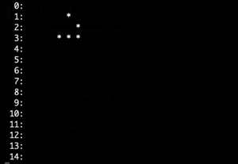

# Conway's Game of Life (C++ Implementation)

A lightweight, high-performance C++ implementation of Conway's Game of Life built from scratch. This project features procedural pattern initialization via command-line arguments, a robust automated testing suite using Google Test, and automated simulation recording to animated GIFs.

---

## 🚀 Key Features

*   **Configurable Starter Layouts:** Supports execution arguments to determine the initial grid layout. Available presets are `random`, `cross`, `glider`, and `gun` (defaults to `pentadecathlon`).
*   **Object-Oriented Design:** Clear separation of concerns with isolated `Cell` logic managing local rules and state changes.
*   **Automated Testing Suite:** Integrated with Google Test (`gtest`) to continuously verify grid neighborhood queries and cell death/survival logic.

---

## 📜 The Rules of Life

Every cell interacts with its eight neighbors on a 2D orthogonal grid. At each tick, the following transitions occur:
1.  **Underpopulation:** Any live cell with fewer than two live neighbors dies.
2.  **Survival:** Any live cell with two or three live neighbors lives on.
3.  **Overpopulation:** Any live cell with more than three live neighbors dies.
4.  **Reproduction:** Any dead cell with exactly three live neighbors becomes a live cell.

---

## 🎮 Command-Line Arguments & Presets

You can pass an optional argument to the binary to spawn specific structures. Leaving it empty triggers the default oscillator pattern.

| Argument | Initial Configuration Description |
| :--- | :--- |
| *(None / Default)* | **Pentadecathlon:** A powerful 15-period oscillator. |
| `random` | **Random Grid:** Randomly generates living cells with a 50x50 boundary. |
| `cross` | **Cross Pattern:** Spawns a localized linear vertical cross structure. |
| `glider` | **Glider:** A small 5-cell structure that crawls diagonally across the screen indefinitely. |
| `gun` | **Gosper Glider Gun:** A complex layout that continuously creates and shoots moving Gliders. |

---

## 🛠️ Getting Started

### Prerequisites

*   A C++ compiler supporting C++17 or higher
*   **CMake** (version 3.10+)
*   Google Test framework (if running tests locally)

### Running the Simulation

Execute the binary with or without arguments inside your build directory:

```bash
# Start with the default Pentadecathlon oscillator
./lifegame

# Start with a moving Glider pattern
./lifegame glider

# Start with the Gosper Glider Gun
./lifegame gun
```

---

## 📁 Project Structure

```text
├── output/
│   └── lifegame.gif     # Automatically generated simulation recording
├── CMakeLists.txt       # Build system instructions
├── gtest.cpp            # Core unit testing logic utilizing Google Test
├── lifegame.cpp         # Main logic implementing grid loops and behaviors
├── lifegame.h           # Header declarations defining Cell and Grid structures
├── main.cpp             # Execution entry point handling command-line arguments
└── README.md            # Project documentation
```

---

## Output of Glider
